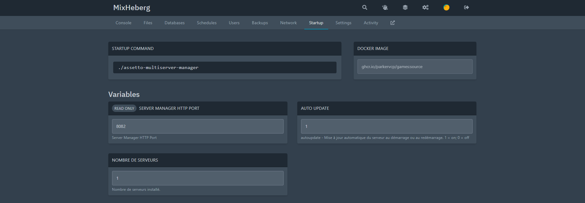

---
---

# Server Manager

## Présentation

**Qu'est-ce que Server Manager ?**

**Server Manager** est un gestionnaire de serveur pour Asseto Corsa. Il permet de faire fonctionner plusieurs serveurs Asseto Corssa en simultané en plus de fournir des outils dédiés au Asseto Corsa comme : **un lap timing**, **un classement des meilleurs coureurs**.

## Tutoriels

Voici quelques tutoriels pour Asseto Corsa Server Manager :

### Avoir plusieurs serveurs

Les offres Asseto Corsa de MixHeberg sont dimensionné pour vous permettre d'avoir plusieurs serveurs même avec l'offre la plus basse.

| Offre   | Ports fournis | Serveurs possible |
| ------- | ------------- | ----------------- |
| Offre 1 | 5 ports       | 2 serveurs        |
| Offre 2 | 7 ports       | 3 serveurs        |
| Offre 3 | 9 ports       | 4 serveurs        |
| Offre 4 | 11 ports      | 5 serveurs        |

Pour avoir plusieurs serveurs, vous devez commencer par aller sur le panel de votre serveur et aller dans l'onglet **Startup**.

