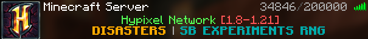
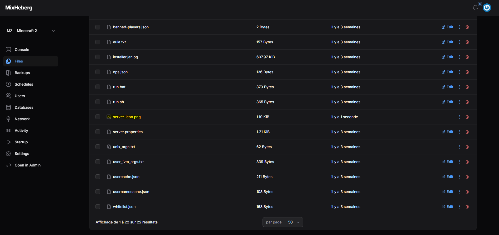
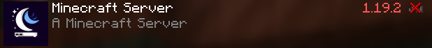

---
---

# Icône de serveur

Les icônes de serveurs sont de petites images affiché dans la liste des serveurs.

Ces icônes sont souvent utilisé pour reconnaître plus facilement les serveurs.

## Exigence de Minecraft

Minecraft possède quelques exigences pour ces icônes.

- L'image doit fait **64px** par **64px**
- L'image doit être au format `.png`
- L'image doit s'appeler `server-icon.png`

:::warning

Attention si vous n'avez pas les extensions de fichier affiché et que vous ajoutez le `.png`, cela ne fonctionnera pas.

:::

## Mettre l'image

Une fois que votre image est prête il vous suffit d'aller à la racine des fichiers de votre serveur, puis de glisser l'image.

:::info

Pour que le nouvel icône de votre serveur apparaisse, il vous suffit de redémarrer votre serveur !

:::

Et voila, votre icône est affiché dans la liste des serveurs !

